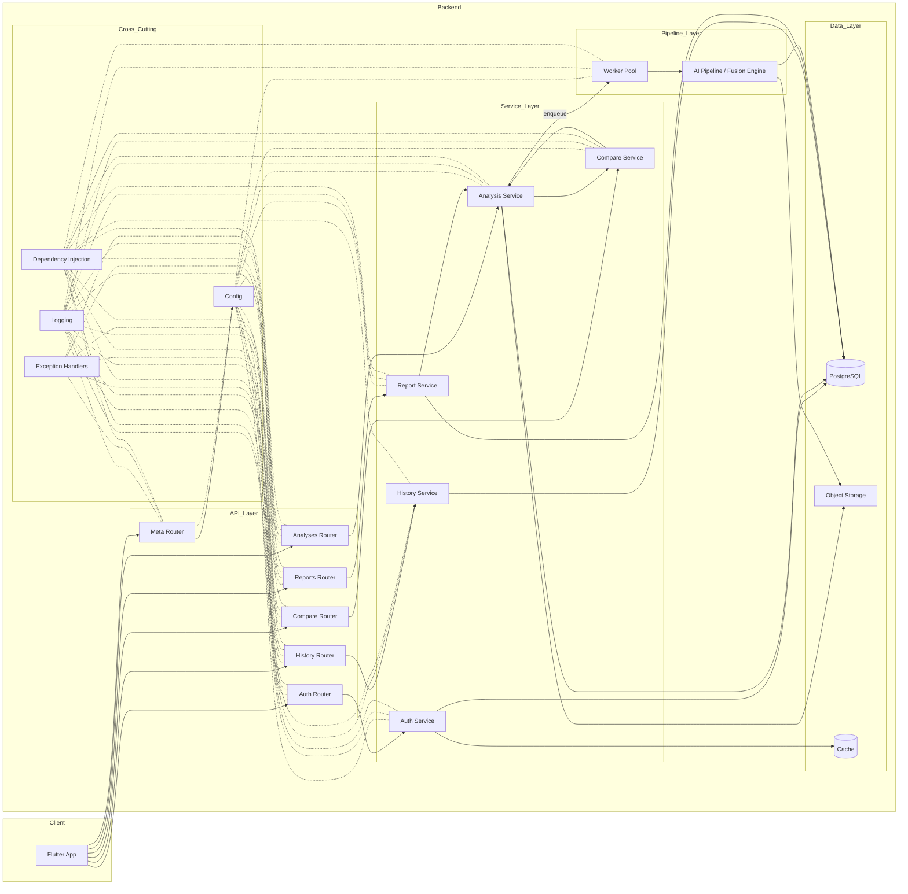
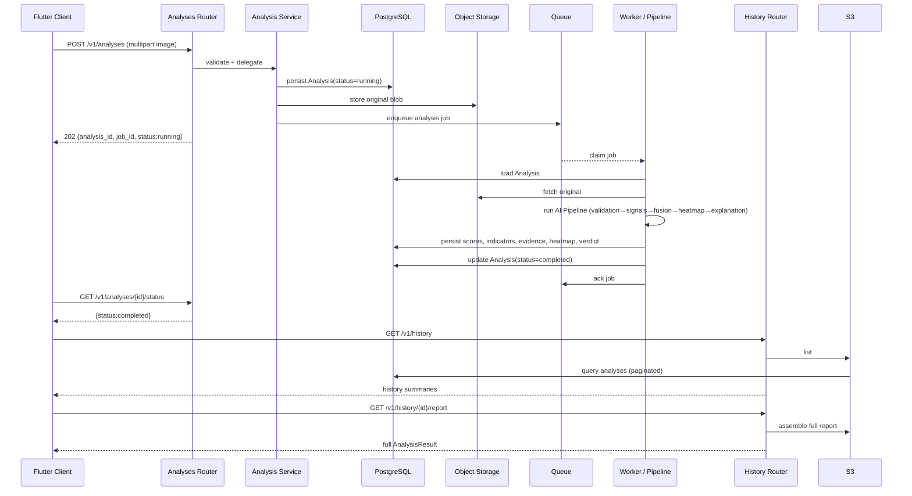
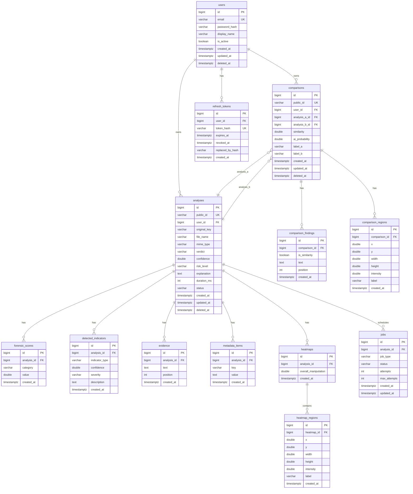
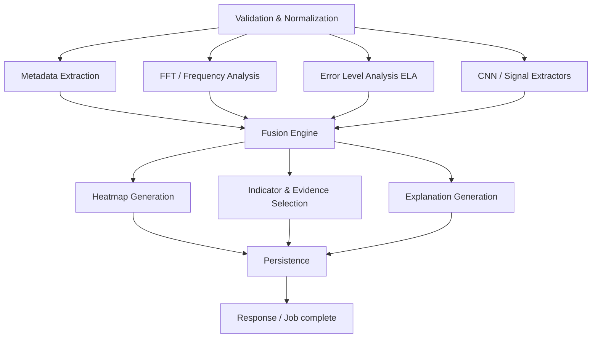
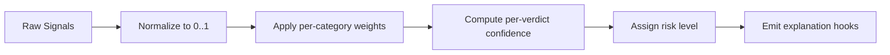

# Chai AI Backend Architecture & API Specification

**Version 1.0**

**Status:** Baseline for implementation (single source of truth for the backend).

**Owner:** Chai AI Engineering

---

## Table of Contents

1. [Product Responsibilities](#1-product-responsibilities)
2. [System Architecture](#2-system-architecture)
3. [High-Level Architecture Diagram](#3-high-level-architecture-diagram)
4. [Request Lifecycle Diagram](#4-request-lifecycle-diagram)
5. [Folder Structure](#5-folder-structure)
6. [Database Design](#6-database-design)
7. [ER Diagram](#7-er-diagram)
8. [Domain Models](#8-domain-models)
9. [Object Storage Design](#9-object-storage-design)
10. [API Design](#10-api-design)
11. [Endpoint Catalog](#11-endpoint-catalog)
12. [DTO Definitions](#12-dto-definitions)
13. [AI Pipeline](#13-ai-pipeline)
14. [Fusion Engine](#14-fusion-engine)
15. [Background Jobs](#15-background-jobs)
16. [Authentication Strategy](#16-authentication-strategy)
17. [Security](#17-security)
18. [Error Model](#18-error-model)
19. [Observability](#19-observability)
20. [Logging](#20-logging)
21. [Performance Targets](#21-performance-targets)
22. [Configuration](#22-configuration)
23. [Testing Strategy](#23-testing-strategy)
24. [Implementation Roadmap](#24-implementation-roadmap)
25. [Future Extensions](#25-future-extensions)
26. [Open Questions](#26-open-questions)

---

## 1. Product Responsibilities

Chai AI is an AI-powered image authenticity and forensic analysis platform. It
answers a single core question for any uploaded image:

> **Is this image original, AI-edited, or AI-generated?**

To answer that question with engineering credibility, the platform must:

- Accept user-uploaded images (JPEG, PNG, WebP) up to 25 MB.
- Analyze images for low-level manipulation artifacts (frequency, texture,
  metadata, diffusion, compression).
- Produce an explainable **verdict** (`original`, `ai_edited`, `ai_generated`),
  a **confidence** score in `[0, 1]`, and a **risk level** (`low`, `medium`,
  `high`).
- Return fine-grained forensic **scores** and **detected indicators** that
  explain *why* the verdict was reached.
- Return a localized **manipulation heatmap** (normalized regions with
  intensity) when manipulation is detected.
- Persist per-user **history** so results can be revisited, favorited, and
  exported.
- Support **two-image comparison** (similarity, differences, shared manipulated
  regions).
- Generate downloadable **PDF reports** and **share text**.
- Provide predictable, documented **API** consumed by the Chai AI Flutter
  application.

**Why this matters architecturally:** every non-trivial responsibility (analysis,
history, comparison, reports) is a distinct concern with distinct persistence and
compute requirements. The architecture deliberately separates them into
versioned API routers, isolated repositories, and a stage-based pipeline so each
can evolve independently without cross-contamination.

**Non-responsibilities (out of scope for the core service):** no real-time image
editing, no user-generated content moderation beyond analytic results, no
multi-tenancy beyond a simple user identity, and no training of models (the
platform *consumes* pre-trained signal extractors).

---

## 2. System Architecture

### 2.1 Context

Chai AI is delivered as a **monolithic FastAPI backend** with a **layered, clean
architecture**. A monolith is chosen deliberately for this product:

- A single small team owns the whole backend.
- The request path (upload → pipeline → persistence → response) is naturally
  sequential and benefits from in-process orchestration.
- The forensic pipeline is CPU-bound but runs in background workers, so the API
  layer stays responsive.
- Deploying one service today dramatically lowers operational cost relative to a
  microservice fleet whose boundaries are not yet proven.

The monolith is *structured* as if it were modular: **API** (`api/`), **services**
(`services/`), **repositories** (`repos/`), **models** (`models/`), **pipeline**
(`pipeline/`), and **clients** (`clients/`) are separate packages with strict
one-way dependencies. This keeps a future extraction into microservices
mechanical rather than architectural.

### 2.2 Layers and dependency rules

Dependencies flow only inward (toward the core), never outward:

```
API (routers, schemas)  →  Services  →  Repositories  →  Models / DB
                                          ↓
                                       Clients (storage, cache, providers)
Pipeline (workers)  →  Repositories  →  Models / DB
```

Rules:

- `api/` depends on `services/`, `schemas/`, `core/`. It never touches
  `models/` or `repos/` directly.
- `services/` orchestrate: they call `repos/`, `clients/`, and `pipeline/`.
  They must not contain raw SQL or storage-path logic.
- `repos/` perform persistence only. They return ORM entities and accept query
  parameters; no business decisions.
- `models/` are pure ORM — no business methods.
- `pipeline/` runs signal extraction and fusion; it is invoked by workers and
  writes results through repositories.
- `clients/` wrap external/infrastructure dependencies (object storage, cache,
  optional LLM/provider) behind narrow interfaces so the rest of the system is
  decoupled from any concrete vendor.

### 2.3 Request path (synchronous retryable path)

1. Client uploads an image to the **analyses** endpoint.
2. The API validates the file (size, MIME, magic bytes) **synchronously**.
3. The analysis service persists an `Analysis` record (and the original blob to
   object storage), enqueues a **job**, and returns `202 Accepted` with the
   `analysis_id` and `job_id`.
4. A background worker runs the **AI pipeline**, persists the results, and marks
   the job complete.
5. The client polls the **status** endpoint (or the frontend seeds/discovers
   results) and fetches the completed analysis.

### 2.4 Why synchronous validation + async analysis

Upload/validation is fast and must fail immediately (413/415/422). The forensic
pipeline is comparatively slow (model inference, FFT, ELA) and must not block the
HTTP worker. Splitting them yields predictable latency for the client and lets
the pipeline scale independently (more workers, no API blocking).

---

## 3. High-Level Architecture Diagram



---

## 4. Request Lifecycle Diagram

The following sequence shows the primary analysis flow (upload → async pipeline →
completion → client fetch). It is representative; history/compare/reports flows
share the same shape (resource → service → persistence → response).



---

## 5. Folder Structure

The structure below is the target for the completed backend. A bracket `**` marks
a module reserved for a later milestone; a plain name marks the foundation that
exists today (Milestone 1).

```
backend/
├── app/
│   ├── main.py                  # Application factory + ASGI entry point
│   ├── __init__.py              # Package version
│   ├── core/
│   │   ├── config.py            # Settings (pydantic-settings, CHAI_ prefix)
│   │   ├── constants.py         # Centralized constants (pagination, limits, retention)
│   │   ├── db.py                # ** Engine/Session factory, Base**
│   │   ├── errors.py            # ErrorCode catalog + envelope builder
│   │   ├── exceptions.py        # ChaiError hierarchy
│   │   ├── logging.py           # Structured JSON logging + request id context
│   │   └── middleware/
│   │       ├── request_id.py    # Request id ingress/echo
│   │       ├── timing.py        # Per-request latency
│   │       └── trusted_host.py  # Host allowlist
│   ├── api/
│   │   ├── deps.py              # Dependency injection (settings, request id, db, storage, repos)
│   │   ├── errors.py            # Global exception handlers → envelope
│   │   └── v1/
│   │       ├── router.py        # Aggregates versioned routers
│   │       ├── meta.py          # Liveness/readiness (implemented)
│   │       ├── auth.py          # ** Milestone 5
│   │       ├── analyses.py      # ** Milestone 6
│   │       ├── history.py       # ** Milestone 8
│   │       ├── compare.py       # ** Milestone 9
│   │       └── reports.py       # ** Milestone 10
│   ├── schemas/                 # Pydantic DTOs (mirror Flutter models)
│   │   ├── common.py            # Error envelope, health
│   │   ├── auth.py              # ** Milestone 5
│   │   ├── analysis.py          # ** Milestone 6
│   │   ├── jobs.py              # ** Milestone 6
│   │   ├── history.py           # ** Milestone 8
│   │   ├── compare.py           # ** Milestone 9
│   │   └── report.py            # ** Milestone 10
│   ├── services/                # ** Business orchestration
│   │   ├── auth_service.py
│   │   ├── analysis_service.py
│   │   ├── history_service.py
│   │   ├── compare_service.py
│   │   ├── job_service.py
│   │   └── report_service.py
│   ├── repos/                   # ** Data access
│   │   ├── base.py              # BaseRepository (CRUD, pagination, filtering)
│   │   ├── user_repo.py
│   │   ├── analysis_repo.py
│   │   ├── history_repo.py
│   │   ├── comparison_repo.py
│   │   ├── job_repo.py
│   │   └── token_repo.py
│   ├── models/                  # ** ORM entities (Milestone 3)
│   │   ├── base.py              # Base, TimestampMixin, SoftDeleteMixin
│   │   ├── user.py
│   │   ├── analysis.py
│   │   ├── comparison.py
│   │   ├── job.py
│   │   └── refresh_token.py
│   ├── pipeline/                # ** AI pipeline (Milestone 7)
│   │   ├── runner.py            # Orchestrates stages
│   │   ├── signals/             # FFT, ELA, metadata, normalization
│   │   └── fusion.py            # Fusion engine
│   ├── clients/                 # Adapters for external/infra systems
│   │   ├── storage.py           # StorageClient interface + LocalStorageAdapter
│   │   ├── cache.py             # ** Redis cache
│   │   ├── openrouter.py        # ** optional LLM explanation
│   │   └── sightengine.py       # ** optional external GenAI scorer
│   ├── workers/                 # ** Background jobs (Milestone 6)
│   │   ├── broker.py            # Queue abstraction
│   │   └── tasks.py             # Job handlers
│   └── utils/
│       ├── pagination.py        # ** Page/limit parsing + envelope
│       └── image.py             # ** Magic-byte/dimension guards
├── alembic/                     # ** Alembic migrations (Milestone 3)
│   ├── versions/
│   ├── env.py
│   ├── script.py.mako
│   └── alembic.ini
├── tests/
│   ├── conftest.py              # Shared fixtures
│   ├── unit/                    # Config, logging, errors, middleware, repos
│   └── integration/             # Health, DB, storage, migration smoke
├── pyproject.toml               # Packaging, deps, Ruff, Pytest
├── .env.example                 # Configuration template
└── README.md
```

---

## 6. Database Design

### 6.1 Engine and environment policy

- **Primary target:** PostgreSQL 14+ in production.
- **Development:** SQLite for fast local iteration.
- **Testing:** SQLite in-memory (or file-backed) isolated per test.
- **Database connectivity is fully configuration-driven.** No connection string
  is hardcoded; it is assembled from `CHAI_DATABASE_URL` (or discrete
  host/port/name/user/password settings) selected by `CHAI_ENVIRONMENT`.
- Migrations are the **only** schema source of truth. `create_all()` is used
  exclusively for tests.

### 6.2 Naming and type conventions

- Tables are lowercase `snake_case`, pluralized.
- Primary keys are `id BIGSERIAL`/`INTEGER` (SQLite) for relational tables; the
  public-facing resource id is a separate opaque string (`ana_...`, `job_...`).
- Timestamps are `created_at`, `updated_at` (`TIMESTAMPTZ` in PostgreSQL).
- Soft delete uses `deleted_at` (`TIMESTAMPTZ NULL`); a row is "live" when
  `deleted_at IS NULL`.
- All money/confidence/similarity values are `DOUBLE PRECISION` clamped to
  `[0,1]` where they represent a ratio.
- Enums are stored as native PostgreSQL `ENUM` types in production but modeled
  as Python `str`-backed enums centralized in one module to avoid duplicate
  literals.

### 6.3 Migration strategy

- Alembic manages schema versions.
- The **initial migration** creates every table, enum, index, FK, and constraint.
- Forward-only migrations; destructive changes (drops) are gated and reviewed.
- Every migration is smoke-tested in CI against a clean database.

### 6.4 Soft delete policy

- User-owned content and analyses support soft delete.
- Hard-purge runs for rows older than `SOFT_DELETED_PURGE_AFTER_DAYS = 90`.
- Anonymous (unauthenticated) originals are purged after
  `ANON_ORIGINALS_RETENTION_DAYS = 7`.
- Indexes that anchor user-facing queries filter on `deleted_at IS NULL`.

### 6.5 Table inventory

Every table is documented field-by-field below (see Domain Models). A summary:

| Table | Purpose | Soft delete |
| --- | --- | --- |
| `users` | Authenticated accounts | yes |
| `analyses` | One analyzed image, its verdict and lifecycle | yes |
| `forensic_scores` | Per-category confidence breakdown of an analysis | no (cascade) |
| `detected_indicators` | Discrete manipulation signals found | no (cascade) |
| `evidence` | Free-text forensic evidence lines | no (cascade) |
| `metadata_items` | Key/value image metadata snapshot | no (cascade) |
| `heatmaps` | Heatmap aggregate for an analysis | no (cascade) |
| `heatmap_regions` | Localized manipulation rectangles | no (cascade) |
| `comparisons` | Two-image comparison record | yes |
| `comparison_findings` | Similarities/differences text lines | no (cascade) |
| `comparison_regions` | Shared manipulated regions | no (cascade) |
| `jobs` | Background job lifecycle record | no |
| `refresh_tokens` | Refresh-token rotation log | no |

---

## 7. ER Diagram



---

## 8. Domain Models

All field semantics below are derived from the Chai AI Flutter models, constants,
and the reserved backend structure. No implementation code is included here.

### 8.1 `users`

| Column | Type | Nullable | Notes |
| --- | --- | --- | --- |
| `id` | bigint PK | no | Surrogate key |
| `email` | varchar(254) | no | UK; lowercase-normalized |
| `password_hash` | varchar(255) | no | Argon2id hash |
| `display_name` | varchar(100) | no | |
| `is_active` | boolean | no | default true |
| `created_at` | timestamptz | no | |
| `updated_at` | timestamptz | no | |
| `deleted_at` | timestamptz | yes | Soft delete |

Constraints: unique `email`; `CHECK (char_length(email) <= 254)`.
Relationships: 1→N `analyses`, 1→N `comparisons`, 1→N `refresh_tokens`.
Cascade: deleting a user soft-deletes owned analyses and comparisons; refresh
tokens are hard-revoked.

### 8.2 `analyses`

| Column | Type | Nullable | Notes |
| --- | --- | --- | --- |
| `id` | bigint PK | no | Surrogate key |
| `public_id` | varchar(64) | no | UK; opaque `ana_...` |
| `user_id` | bigint FK | yes | null = anonymous |
| `original_key` | varchar(255) | no | Object-storage key of original |
| `file_name` | varchar(255) | yes | Original client filename |
| `mime_type` | varchar(50) | yes | Sniffed at upload |
| `verdict` | enum | yes | null until completed |
| `confidence` | double | yes | `[0,1]`, null until completed |
| `risk_level` | enum | yes | null until completed |
| `explanation` | text | yes | null until completed |
| `duration_ms` | int | yes | Pipeline wall time |
| `status` | enum | no | `running`/`completed`/`failed` |
| `created_at` | timestamptz | no | |
| `updated_at` | timestamptz | no | |
| `deleted_at` | timestamptz | yes | Soft delete |

Indexes: unique (`public_id`); (`user_id`, `created_at DESC`) for history;
(`status`) for job scanning; partial (`deleted_at IS NULL`).
Relationships: 1→N to all child tables; N→1 to `users`.
Cascade: `forensic_scores`, `detected_indicators`, `evidence`, `metadata_items`,
`heatmaps` are **cascade-deleted** with the analysis.

### 8.3 `forensic_scores`

Per-category confidence (`ScoreCategory`): texture, metadata, lighting,
frequency, noisePattern, compression, edgeConsistency, colorDistribution.

| Column | Type | Nullable | Notes |
| --- | --- | --- | --- |
| `id` | bigint PK | no | |
| `analysis_id` | bigint FK | no | → analyses |
| `category` | enum | no | ScoreCategory |
| `value` | double | no | `[0,1]` |
| `created_at` | timestamptz | no | |

Index: (`analysis_id`). Constraint: `CHECK (value BETWEEN 0 AND 1)`.
Cascade: delete with analysis.

### 8.4 `detected_indicators`

| Column | Type | Nullable | Notes |
| --- | --- | --- | --- |
| `id` | bigint PK | no | |
| `analysis_id` | bigint FK | no | → analyses |
| `indicator_type` | enum | no | IndicatorType |
| `confidence` | double | no | `[0,1]` |
| `severity` | enum | no | low/moderate/strong |
| `description` | text | no | |
| `created_at` | timestamptz | no | |

Constraint: `CHECK (confidence BETWEEN 0 AND 1)`. Cascade with analysis.

### 8.5 `evidence`

Free-text lines in display order.

| Column | Type | Nullable | Notes |
| --- | --- | --- | --- |
| `id` | bigint PK | no | |
| `analysis_id` | bigint FK | no | → analyses |
| `text` | text | no | |
| `position` | int | no | Display order |
| `created_at` | timestamptz | no | |

Index: (`analysis_id`, `position`). Cascade with analysis.

### 8.6 `metadata_items`

Key/value snapshot of image metadata (camera, software, resolution, format,
size, …).

| Column | Type | Nullable | Notes |
| --- | --- | --- | --- |
| `id` | bigint PK | no | |
| `analysis_id` | bigint FK | no | → analyses |
| `key` | varchar(100) | no | |
| `value` | text | no | |
| `created_at` | timestamptz | no | |

Unique: (`analysis_id`, `key`) enforced in application; index on (`analysis_id`).
Cascade with analysis.

### 8.7 `heatmaps`

| Column | Type | Nullable | Notes |
| --- | --- | --- | --- |
| `id` | bigint PK | no | |
| `analysis_id` | bigint FK | no | → analyses; 1:1 |
| `overall_manipulation` | double | no | `[0,1]` |
| `created_at` | timestamptz | no | |

Unique on (`analysis_id`). Cascade; 1→N `heatmap_regions`.

### 8.8 `heatmap_regions`

Normalized rectangle within the image (all coordinates in `[0,1]`).

| Column | Type | Nullable | Notes |
| --- | --- | --- | --- |
| `id` | bigint PK | no | |
| `heatmap_id` | bigint FK | no | → heatmaps |
| `x`, `y`, `width`, `height` | double | no | Normalized `[0,1]` |
| `intensity` | double | no | `[0,1]` |
| `label` | varchar(100) | no | `Synthesized region` / `Edited region` |
| `created_at` | timestamptz | no | |

Constraints: coordinates in `[0,1]`. Index (`heatmap_id`). Cascade with heatmap.

### 8.9 `comparisons`

| Column | Type | Nullable | Notes |
| --- | --- | --- | --- |
| `id` | bigint PK | no | |
| `public_id` | varchar(64) | no | UK; `cm_...` |
| `user_id` | bigint FK | yes | null = anonymous |
| `analysis_a_id` | bigint FK | no | → analyses |
| `analysis_b_id` | bigint FK | no | → analyses |
| `similarity` | double | no | `[0,1]` |
| `ai_probability` | double | no | `[0,1]` |
| `label_a` | varchar(50) | no | |
| `label_b` | varchar(50) | no | |
| `created_at` | timestamptz | no | |
| `updated_at` | timestamptz | no | |
| `deleted_at` | timestamptz | yes | Soft delete |

Index: unique `public_id`; (`user_id`, `created_at DESC`). Relationships:
N→1 `users`, N→1 each `analyses`. Cascade: children deleted with comparison.

### 8.10 `comparison_findings`

| Column | Type | Nullable | Notes |
| --- | --- | --- | --- |
| `id` | bigint PK | no | |
| `comparison_id` | bigint FK | no | → comparisons |
| `is_similarity` | boolean | no | true=similarity, false=difference |
| `text` | text | no | |
| `position` | int | no | Display order |
| `created_at` | timestamptz | no | |

Index (`comparison_id`, `position`). Cascade.

### 8.11 `comparison_regions`

| Column | Type | Nullable | Notes |
| --- | --- | --- | --- |
| `id` | bigint PK | no | |
| `comparison_id` | bigint FK | no | → comparisons |
| `x`, `y`, `width`, `height` | double | no | Normalized `[0,1]` |
| `intensity` | double | no | `[0,1]` |
| `label` | varchar(100) | no | |
| `created_at` | timestamptz | no | |

Index (`comparison_id`). Cascade.

### 8.12 `jobs`

| Column | Type | Nullable | Notes |
| --- | --- | --- | --- |
| `id` | bigint PK | no | |
| `analysis_id` | bigint FK | no | → analyses |
| `job_type` | enum | no | `analysis` / `compare` / `report` |
| `status` | enum | no | queued/running/succeeded/failed |
| `attempts` | int | no | default 0 |
| `max_attempts` | int | no | default 3 |
| `created_at` | timestamptz | no | |
| `updated_at` | timestamptz | no | |

Indexes: (`status`, `created_at`) for worker scanning; (`analysis_id`).
Constraint: `CHECK (attempts BETWEEN 0 AND max_attempts)`.

### 8.13 `refresh_tokens`

| Column | Type | Nullable | Notes |
| --- | --- | --- | --- |
| `id` | bigint PK | no | |
| `user_id` | bigint FK | no | → users |
| `token_hash` | varchar(255) | no | UK; SHA-256 of the raw token |
| `expires_at` | timestamptz | no | |
| `revoked_at` | timestamptz | yes | Null = active |
| `replaced_by_hash` | varchar(255) | yes | Supports rotation chain |
| `created_at` | timestamptz | no | |

Index: unique `token_hash`; (`user_id`, `revoked_at`). Only hashes stored.

### 8.14 Enums (centralized module)

All enum literals live in a single `core/enums.py` (or `models/enums.py`),
referenced by both models and DTOs. No string is duplicated across modules.

- `Verdict`: `original`, `ai_edited`, `ai_generated`
- `RiskLevel`: `low`, `medium`, `high`
- `IndicatorType`: `frequency`, `texture`, `metadata`, `diffusion`, `compression`
- `ScoreCategory`: `texture`, `metadata`, `lighting`, `frequency`,
  `noisePattern`, `compression`, `edgeConsistency`, `colorDistribution`
- `AnalysisStatus`: `running`, `completed`, `failed`
- `JobType`: `analysis`, `compare`, `report`
- `JobStatus`: `queued`, `running`, `succeeded`, `failed`
- `IndicatorSeverity`: `low`, `moderate`, `strong`

---

## 9. Object Storage Design

### 9.1 Abstraction

Storage is exposed only through a narrow `StorageClient` interface so the rest of
the system is decoupled from the concrete backend:

- `Store(bytes, key, content_type)` → writes an object
- `Fetch(key)` → returns bytes
- `Delete(key)` → removes an object
- `Exists(key)` → existence check
- `SignedUrl(key, ttl)` → **future**, returns a temporary access URL

**Milestone 2** ships only `LocalStorageAdapter` (filesystem) with the storage
root read from configuration. MinIO/S3 adapters are future extensions that
implement the same interface without touching callers.

### 9.2 Key layout

Object keys are content-addressed and partitionable:

```
{env}/orig/{sha256-16}.{ext}
{env}/heatmap/{analysis_public_id}.png
{env}/report/{analysis_public_id}.pdf
```

Using a content hash enables de-duplication and cheap cache-key reuse for
identical uploads.

### 9.3 Retention

- Anonymous originals: purged after `ANON_ORIGINALS_RETENTION_DAYS = 7`.
- Soft-deleted originals: purged after `SOFT_DELETED_PURGE_AFTER_DAYS = 90`.

### 9.4 Why a filesystem-first abstraction

Development and testing need a zero-dependency local backend. A stable interface
means the production S3/MinIO adapter can be added without any repository,
service, or pipeline changes.

---

## 10. API Design

### 10.1 Conventions

- **Base URL:** `/v1` (from `API_V1_PREFIX`).
- **Content-Type:** `application/json` unless the endpoint is a multipart upload
  or a binary download.
- **Auth:** `Authorization: Bearer <access_token>`; refresh uses
  `POST /v1/auth/refresh`.
- **Request id:** echoed on `X-Request-ID` and correlated through every
  downstream log line.
- **Pagination:** every list endpoint accepts `?page` (1-based) and `?limit`
  (default `DEFAULT_PAGE_SIZE = 20`, max `MAX_PAGE_SIZE = 100`) and returns a
  page envelope (`items`, `total`, `page`, `limit`, `has_more`).
- **Errors:** every error uses the envelope in [Section 18](#18-error-model).
- **Versioning:** URI-based major versioning (`/v1`). Additive changes within a
  version are backward-compatible; breaking changes bump the prefix to `/v2`.

### 10.2 Design rationale

- **Async resource lifecycle (202 + poll)** reflects that the pipeline is
  non-trivial to run; the client is not blocked.
- **Collection + detail + status** shapes make the resource model uniform across
  analyses, history, and comparisons, lowering implementation and client cost.
- **Multipart upload** keeps image bytes out of JSON and enables streaming and
  magic-byte validation server side.

---

## 11. Endpoint Catalog

### 11.1 Meta (implemented, Milestone 1)

| Method | Path | Purpose |
| --- | --- | --- |
| GET | `/v1/health` | Liveness probe |
| GET | `/v1/health/ready` | Readiness with per-system checks |

### 11.2 Auth (Milestone 5)

| Method | Path | Purpose |
| --- | --- | --- |
| POST | `/v1/auth/register` | Create account |
| POST | `/v1/auth/login` | Authenticate → tokens |
| POST | `/v1/auth/refresh` | Rotate access token |
| POST | `/v1/auth/logout` | Revoke refresh token |

### 11.3 Analyses (Milestone 6/7)

| Method | Path | Purpose |
| --- | --- | --- |
| POST | `/v1/analyses` | Upload + start analysis (202) |
| GET | `/v1/analyses/{public_id}` | Full analysis result |
| GET | `/v1/analyses/{public_id}/status` | Job status |
| GET | `/v1/analyses/{public_id}/heatmap` | Heatmap image/regions |
| GET | `/v1/analyses/{public_id}/original` | Original image bytes |

### 11.4 History (Milestone 8)

| Method | Path | Purpose |
| --- | --- | --- |
| GET | `/v1/history` | Paginated history summaries |
| GET | `/v1/history/{public_id}` | Full stored analysis |
| POST | `/v1/history/{public_id}/favorite` | Toggle favorite |
| DELETE | `/v1/history/{public_id}` | Soft delete (history) |
| DELETE | `/v1/history` | Clear history |

### 11.5 Compare (Milestone 9)

| Method | Path | Purpose |
| --- | --- | --- |
| POST | `/v1/compare` | Compare two images (202) |
| GET | `/v1/compare/{public_id}` | Comparison result |

### 11.6 Reports (Milestone 10)

| Method | Path | Purpose |
| --- | --- | --- |
| GET | `/v1/reports/{analysis_public_id}.pdf` | PDF download |
| GET | `/v1/reports/{analysis_public_id}/share-text` | Share text |

---

## 12. DTO Definitions

DTOs are Pydantic models that exactly mirror the Flutter frontend models
(`analysis_result.dart`, `analysis_components.dart`, `compare_result.dart`,
`history_item.dart`, `verdict.dart`). Field-by-field below.

### 12.1 Enums (shared with models)

| Enum | Values |
| --- | --- |
| `Verdict` | `original`, `ai_edited`, `ai_generated` |
| `RiskLevel` | `low`, `medium`, `high` |
| `IndicatorType` | `frequency`, `texture`, `metadata`, `diffusion`, `compression` |
| `ScoreCategory` | `texture`, `metadata`, `lighting`, `frequency`, `noisePattern`, `compression`, `edgeConsistency`, `colorDistribution` |

### 12.2 `ForensicScore`

| Field | Type | Nullable | Validation |
| --- | --- | --- | --- |
| `category` | ScoreCategory | no | Enum |
| `value` | float | no | `0.0 ≤ v ≤ 1.0` |

Example: `{"category": "texture", "value": 0.83}`

### 12.3 `DetectedIndicator`

| Field | Type | Nullable | Validation |
| --- | --- | --- | --- |
| `type` | IndicatorType | no | Enum |
| `confidence` | float | no | `0.0 ≤ v ≤ 1.0` |
| `severity` | str | no | `Low` \| `Moderate` \| `Strong` |
| `description` | str | no | Non-empty |

### 12.4 `HeatmapRegion`

| Field | Type | Nullable | Validation |
| --- | --- | --- | --- |
| `x` | float | no | `0.0 ≤ v ≤ 1.0` |
| `y` | float | no | `0.0 ≤ v ≤ 1.0` |
| `width` | float | no | `0.0 ≤ v ≤ 1.0` |
| `height` | float | no | `0.0 ≤ v ≤ 1.0` |
| `intensity` | float | no | `0.0 ≤ v ≤ 1.0` |
| `label` | str | no | Non-empty |

### 12.5 `HeatmapData`

| Field | Type | Nullable | Validation |
| --- | --- | --- | --- |
| `regions` | list[HeatmapRegion] | no | May be empty |
| `overallManipulation` | float | no | `0.0 ≤ v ≤ 1.0` |

### 12.6 `AnalysisResult`

| Field | Type | Nullable | Validation |
| --- | --- | --- | --- |
| `id` | string | no | Opaque id |
| `imagePath` | string | yes | Storage/display path |
| `imageBytes` | bytes | yes | Embedded bytes (disallowed in API JSON) |
| `fileName` | string | yes | |
| `verdict` | Verdict | no | |
| `confidence` | float | no | `0.0 ≤ v ≤ 1.0` |
| `riskLevel` | RiskLevel | no | |
| `explanation` | string | no | Non-empty |
| `analysisDuration` | string (ISO 8601 duration) | no | e.g. `PT2.1S` |
| `timestamp` | string (ISO 8601) | no | UTC |
| `scores` | list[ForensicScore] | no | |
| `indicators` | list[DetectedIndicator] | no | |
| `heatmap` | HeatmapData | yes | Null for originals |
| `evidence` | list[string] | no | |
| `metadata` | map[string,string] | no | |

> **API note:** `imageBytes` is an in-memory field for the Flutter state and is
> **not** transmitted in API JSON; the server serves binaries via dedicated
> download endpoints.

### 12.7 `HistoryItem`

| Field | Type | Nullable | Validation |
| --- | --- | --- | --- |
| `id` | string | no | |
| `imagePath` | string | yes | |
| `fileName` | string | yes | |
| `verdict` | Verdict | no | |
| `confidence` | float | no | `[0,1]` |
| `riskLevel` | RiskLevel | no | |
| `timestamp` | string (ISO 8601) | no | UTC |
| `isFavorite` | bool | no | default false |

### 12.8 `CompareResult`

| Field | Type | Nullable | Validation |
| --- | --- | --- | --- |
| `labelA` | string | no | |
| `labelB` | string | no | |
| `similarity` | float | no | `[0,1]` |
| `aiProbability` | float | no | `[0,1]` |
| `similarities` | list[string] | no | |
| `differences` | list[string] | no | |
| `manipulatedRegions` | list[HeatmapRegion] | no | |

### 12.9 Common DTOs

- `ErrorBody` / `ErrorResponse` (see Section 18).
- `HealthStatus`, `HealthResponse`, `ReadinessResponse`.
- `PageEnvelope[T]`: `{items: T[], total: int, page: int, limit: int,
  has_more: bool}`.

### 12.10 Auth DTOs (Milestone 5)

- `RegisterRequest`: `email`, `password`, `displayName`.
- `LoginRequest`: `email`, `password`.
- `AuthResponse`: `accessToken`, `refreshToken`, `expiresIn`, `user`.
- `RefreshRequest`: `refreshToken`.
- `UserPayload`: `id`, `email`, `displayName`, `createdAt`.

---

## 13. AI Pipeline

The pipeline is a sequence of independent stages executed inside a background
worker. Each stage is a pure function over the image and prior outputs; this
makes the pipeline testable, observable, and resumable.



### 13.1 Stage: Validation & Normalization

- Re-sniff magic bytes; reject non-image or mismatched content.
- Reject exceed `MAX_UPLOAD_SIZE_BYTES`.
- Normalize orientation and, if needed, scale to a pipeline-defined maximum
  dimension for inference.

### 13.2 Stage: Metadata Extraction

- Read EXIF/XMP/IPTC: camera, software, timestamps, GPS, edit provenance.
- Expose as `MetadataItem` key/values and feed the metadata forensic score.
- Flag inconsistencies between declared software and visible content.

### 13.3 Stage: FFT / Frequency Analysis

- Compute windowed Fourier transform; inspect for periodic resampling lattices,
  upscaling artifacts, and generation-specific spectra.

### 13.4 Stage: ELA (Error Level Analysis)

- Re-save the image at a fixed JPEG quality and diff; high-error regions reveal
  tampering/local re-compression.

### 13.5 Stage: CNN / Signal Extractors

- Run convolutional extractors for texture anomalies, PRNU/sensor-noise presence,
  diffusion ("watercolor") artifacts, and compression-block inconsistencies.
- Each extractor emits raw per-category signals; none decides the verdict alone.

### 13.6 Stage: Fusion Engine

See [Section 14](#14-fusion-engine).

### 13.7 Stage: Heatmap Generation

- Combine per-region saliency from ELA and CNN extractors into normalized
  rectangles (`HeatmapRegion`) plus an `overallManipulation` score.

### 13.8 Stage: Indicator & Evidence Selection

- Map the strongest signals to `DetectedIndicator` instances and pick human
  readable `Evidence` lines.

### 13.9 Stage: Explanation Generation

- Compose a narrative explanation from the verdict, strongest indicator, and
  score distribution. Optionally enriched by an LLM (Milestone 11) within
  `LLM_EXPLANATION_TIMEOUT_SECONDS`.

### 13.10 Stage: Persistence

- Persist all outputs through repositories in a transaction (scores, indicators,
  evidence, metadata, heatmap), then mark the `Analysis` completed and the
  `Job` succeeded.

---

## 14. Fusion Engine

The fusion engine weighs the normalized signals from every extractor into the
final verdict and confidence. It is deliberately a **deterministic, transparent**
component (optionally informed later by an external GenAI scorer or an LLM).



Decision policy:

- Each category is scored in `[0,1]`.
- Category scores are feature-engineered and weighted (weights in config).
- The verdict with the highest fused weight wins; confidence is the fused score.
- `risk_level` derives from verdict + confidence via a configurable threshold
  table.

**Why:** reproducibility and explainability. A fusion-based, partially
rule-driven engine yields defensible results and clear audit trails versus a
single "black box" model. External providers can be layered on later without
changing the output contract.

---

## 15. Background Jobs

- Jobs are recorded in the `jobs` table and executed by a worker pool.
- A queue **broker abstraction** (`workers/broker.py`) isolates the concrete
  transport (initially in-process queue; later Redis/RQ or Celery).
- Each `Job` carries `job_type`, `status`, `attempts`, `max_attempts`.
- Timeouts per job type are enforced:
  - Analysis: `DEFAULT_ANALYSIS_TIMEOUT_SECONDS = 60`
  - Compare: `DEFAULT_COMPARE_TIMEOUT_SECONDS = 45`
  - Report: `DEFAULT_REPORT_TIMEOUT_SECONDS = 20`
  - LLM explanation: `LLM_EXPLANATION_TIMEOUT_SECONDS = 10`
- Retry policy: failed jobs retry up to `max_attempts` with backoff; the last
  failure marks the `Analysis` as `failed`.

---

## 16. Authentication Strategy

- **Password auth** with server-side **Argon2id** hashing (never reversible,
  salted, memory-hard).
- **Access token:** short-lived (e.g., 15 minutes) signed JWT carried in the
  `Authorization` header.
- **Refresh token:** opaque, high-entropy, stored **only as a SHA-256 hash** in
  `refresh_tokens`. Supports rotation/reuse detection (`revoked_at`,
  `replaced_by_hash`). Long lifetime (e.g., 30 days).
- **Endpoints:** `register`, `login`, `refresh`, `logout`.
- **Anonymous analysis:** supported; an `analysis` may have `user_id = NULL`
  and is subject to originals retention.
- **Why:** JWT access + rotatable DB-backed refresh tokens balance stateless
  fast authorization with the ability to revoke and detect replay on the
  long-lived credential.

---

## 17. Security

- **Transport:** TLS everywhere; HSTS in production.
- **Input validation:** size/MIME/magic-byte guards; all DTOs validated by
  Pydantic.
- **Secrets:** all in environment/`.env`, never in code or logs.
- **Passwords:** Argon2id.
- **Rate limiting:** per-IP and per-user on auth and upload endpoints
  (implementation in a later hardening milestone); `RATE_LIMITED` error code.
- **Trusted hosts:** `TrustedHostMiddleware` allowlist (implemented).
- **CORS:** locked to configured origins; credentials disabled unless `*` absent.
- **Path traversal:** object-storage keys generated server side; client filenames
  never used in filesystem paths.
- **Error leakage:** verbose messages only when `debug`/development; production
  returns generic messages.

---

## 18. Error Model

Standard envelope (implemented; spec Section 13):

```json
{
  "error": {
    "code": "invalid_request",
    "message": "message",
    "retryable": false,
    "details": {}
  }
}
```

The `ErrorCode` catalog (`app.core.errors`) drives default HTTP status and
retryability. All failures flow through the single `ChaiError` hierarchy handled
globally by `app.api.errors`.

| Code | HTTP | Retryable |
| --- | --- | --- |
| `invalid_request` | 400 | no |
| `validation_error` | 422 | no |
| `invalid_image` | 422 | no |
| `unsupported_media_type` | 415 | no |
| `file_too_large` | 413 | no |
| `unauthorized` | 401 | no |
| `invalid_credentials` | 401 | no |
| `expired_token` | 401 | no |
| `invalid_refresh_token` | 401 | no |
| `forbidden` | 403 | no |
| `email_taken` | 409 | no |
| `analysis_not_found` | 404 | no |
| `history_not_found` | 404 | no |
| `comparison_not_found` | 404 | no |
| `rate_limited` | 429 | yes |
| `pipeline_error` | 500 | no |
| `provider_error` | 503 | yes |
| `storage_unavailable` | 503 | yes |
| `db_unavailable` | 503 | yes |
| `timeout` | 504 | yes |
| `job_not_found` | 404 | no |
| `internal_error` | 500 | yes |

---

## 19. Observability

- **Metrics:** request rate, latency percentiles, error rate per code, job
  throughput/duration/retries, queue depth, DB pool usage, storage operations.
- **Health/readiness:** `GET /v1/health` and `GET /v1/health/ready` (implemented);
  readiness reports `database`, `storage`, `cache`, `models` subsystems.
- **Audit:** every analysis stores provenance (input hash, pipeline version,
  timing) enabling reproducibility.
- **Distributed tracing:** request id propagated across logs and any future
  worker trace (OpenTelemetry is a future extension).

---

## 20. Logging

- **Structured JSON** to stdout (implemented `JsonFormatter`): `timestamp`,
  `level`, `logger`, `message`, `request_id`.
- Per-request context carrier (`contextvars`) threads `request_id` through every
  log line without parameter threading.
- Access/timing logging per request via `TimingMiddleware`.
- Log level configured via `CHAI_LOG_LEVEL`; verbose/structured controlled via
  `CHAI_JSON_LOGGING`.

---

## 21. Performance Targets

- **Upload/validate (sync):** < 100 ms p95.
- **Background analysis:** target < 20 s p95 for a typical 12 MP JPEG on a
  single worker (excludes enqueue latency; `DEFAULT_ANALYSIS_TIMEOUT_SECONDS=60`
  is the hard budget).
- **Read endpoints (history/detail):** < 200 ms p95 including DB query.
- **History list:** paginated, indexed by (`user_id`, `created_at DESC`).
- **Report:**
  - Compare: < 15 s p95.
  - PDF: < 10 s p95.
- **Concurrency:** worker pool scales horizontally; DB connection pool sized per
  configuration.
- Targets are budgets, not guarantees; they are enforced via the job-timeout
  configuration above.

---

## 22. Configuration

All values are read from `CHAI_`-prefixed environment variables (`.env` in
development) via `pydantic-settings`. Nothing is hardcoded per environment.

| Variable | Default | Purpose |
| --- | --- | --- |
| `CHAI_ENVIRONMENT` | `development` | `development`/`testing`/`production` |
| `CHAI_DEBUG` | `false` | Verbose errors; never in prod |
| `CHAI_JSON_LOGGING` | `true` | Structured JSON vs plain |
| `CHAI_LOG_LEVEL` | `INFO` | Log level |
| `CHAI_CORS_ORIGINS` | `*` | Allowed origins |
| `CHAI_TRUSTED_HOSTS` | `*` | Host allowlist |
| `CHAI_REQUEST_ID_HEADER` | `X-Request-ID` | Request id header |
| `CHAI_DATABASE_URL` | *(env)* | Full DB URL; differs per environment |
| `CHAI_STORAGE_ROOT` | *(env)* | Local storage root (M2) |
| `CHAI_JWT_SECRET` | *(env, prod)* | Access-token signing key |
| `CHAI_ACCESS_TOKEN_TTL` | 15m | Access token lifetime |
| `CHAI_REFRESH_TOKEN_TTL` | 30d | Refresh token lifetime |
| `CHAI_DEFAULT_PAGE_SIZE` | 20 | Pagination default |
| `CHAI_MAX_PAGE_SIZE` | 100 | Pagination max |

Milestone 2 adds `CHAI_DATABASE_URL` and `CHAI_STORAGE_ROOT`; later milestones
add the job/timeout and provider settings listed in `constants.py`.

---

## 23. Testing Strategy

- **Unit tests:** each layer in isolation with fakes (config, enums, validation,
  repositories against SQLite, fusion weights).
- **Integration tests:** FastAPI `TestClient` against an in-memory SQLite DB
  (foundation tests exist; DB/storage tests arrive with Milestone 2).
- **Migration smoke test:** run `alembic upgrade head` on a clean database and
  assert the expected schema (tables, columns, constraints) exists.
- **Storage tests:** write/read/delete round-trips against a temporary storage
  root.
- **Persistence tests:** CRUD, relationships, cascade delete, soft delete,
  indexes (where practical), unique constraints, pagination, filtering, sorting.
- **Lint/format:** Ruff (`ruff check .`, `ruff format --check .`).
- Coverage targets are **quality-driven** (high confidence on the critical paths)
  rather than artificial percentage targets.

---

## 24. Implementation Roadmap

See [implementation-roadmap.md](./implementation-roadmap.md) for the full
milestone-by-milestone plan. Summary:

1. **M1 Foundation** (completed)
2. **M2 Persistence layer** (next)
3. **M3 Object storage** 
4. **M4 Auth**
5. **M5 Analyses API + jobs**
6. **M6 AI pipeline + fusion**
7. **M7 History**
8. **M8 Compare**
9. **M9 Reports**
10. **M10 Hardening** (rate limiting, cache, distributed queue)

---

## 25. Future Extensions

- MinIO/S3 storage adapters behind `StorageClient`.
- Redis-backed queue (Celery/RQ) replacing the in-process broker.
- Redis cache for identical-upload results and rate limiting.
- OpenTelemetry distributed tracing.
- LLM-assisted explanation via OpenRouter (`DEFAULT_...TIMEOUT` constants
  reserved).
- External GenAI scoring via Sightengine as an optional fusion input.
- Multi-region object storage and CDN-signed heatmap/report delivery.

---

## 26. Open Questions

These require product/architecture decisions before or during implementation and
are deliberately flagged rather than assumed:

1. **Anonymous analysis scope:** Are anonymous (unauthenticated) analyses enabled
   at launch, or is authentication required for the analyses/history endpoints?
   Affects retention enforcement and whether `user_id` may be null in practice.
2. **Confidence/verdict thresholds:** The exact fusion weights and the
   verdict→risk-level threshold table are product decisions; wire them as
   configuration so they can be tuned without deploys.
3. **Refresh-token rotation policy:** Reuse detection action (revoke chain vs
   force-logout) needs a security decision.
4. **External providers (Milestone 6/7):** whether to integrate Sightengine
   and/or an LLM explanation by default or keep the pipeline fully in-house.
5. **Data residency/retention:** confirmation of the 7-day anonymous retention
   and 90-day soft-delete purge windows.
6. **PDF rendering:** server-side library choice (e.g., ReportLab/WeasyPrint) is
   a Milestone 10 decision.
7. **Contact/license metadata:** `OPENAPI_CONTACT` and `OPENAPI_LICENSE` are
   placeholders awaiting product input.
8. **Job transport for production:** confirm a broker (Redis-based) before the
   analyses milestone so `broker.py` is implemented once.

---

*End of Backend Architecture & API Specification v1.0.*